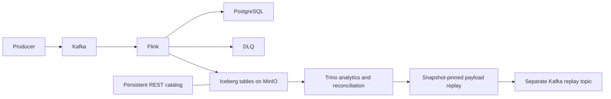

# Iceberg lakehouse and replay

This optional enhancement adds MinIO, a persistent Iceberg REST catalog, and
Trino SQL analytics to the existing Flink/PostgreSQL/DLQ pipeline.
The default job still uses four operational outputs; `LAKEHOUSE_ENABLED=1`
adds three Iceberg outputs to the same StatementSet.



## Fix for unavailable MinIO images

Docker Hub and Quay pulls of the public MinIO images failed in this environment.
The overlay builds its own images from **official upstream sources**:

| Component | Source release | Local image |
| --- | --- | --- |
| MinIO server | `RELEASE.2025-10-15T17-29-55Z` | `grab-lakehouse/minio:RELEASE.2025-10-15T17-29-55Z` |
| MinIO client | `RELEASE.2025-08-13T08-35-41Z` | `grab-lakehouse/mc:RELEASE.2025-08-13T08-35-41Z` |

`lakehouse/minio/Dockerfile` and `Dockerfile.mc` use Go 1.24.8, Go module
checksum verification, limited build parallelism, and small Alpine runtime
images. The first build downloads dependencies and takes several minutes.
Subsequent starts reuse Docker's build cache. No MinIO Docker Hub or Quay
image is needed. The source releases and the [official source build instructions](https://github.com/minio/minio/releases/tag/RELEASE.2025-10-15T17-29-55Z)
remain the provenance for these local builds.

The REST fixture image is pinned to an immutable digest. Its SQLite catalog
database lives on a named volume with WAL mode; restarting it retains table
registrations. MinIO object data lives on a separate named volume. Both are
required for recovery; preserving object files alone is insufficient.
This fixture is intended for the local demo, not catalog high availability.

## Start the lakehouse

From the repository root, with Docker Desktop running:

```powershell
docker compose -f docker-compose.yml -f docker-compose.lakehouse.yml --profile lakehouse build lakehouse-minio lakehouse-bucket-init
docker compose -f docker-compose.yml -f docker-compose.lakehouse.yml --profile lakehouse up -d --no-build lakehouse-minio lakehouse-catalog lakehouse-trino
docker compose -f docker-compose.yml -f docker-compose.lakehouse.yml --profile lakehouse ps -a
```

The bucket initializer creates `warehouse` once without deleting existing data.
Use=ands above start only the optional lakehouse services and their
dependencies. Start Kafka/PostgreSQL separately when running the live pipeline.
If Trino starts before the REST service is ready, allow startup to complete
and retry the query; inspect service logs for persistent errors.

| Service | Host endpoint |
| --- | --- |
| MinIO S3 | `http://localhost:19000` |
| MinIO console | `http://localhost:19001` |
| Iceberg REST catalog | `http://localhost:18181` |
| Trino SQL/UI | `http://localhost:18080` |

Local MinIO credentials are `lakehouse` / `lakehouse-local-password`.
These are development defaults, matching the existing local Compose model.
The optional MinIO and Trino services have 1 GiB and 2 GiB memory limits.

## Enable the writer

Iceberg **1.12.0** supplies the Flink **2.2** runtime; it requires **Java 17**.
The existing Java 11 environment can still run the default non-lakehouse job.
Set `JAVA_HOME` to an installed Java 17 directory before starting Python:

```powershell
$env:JAVA_HOME = 'C:/Program Files/Eclipse Adoptium/jdk-17.0.18.8-hotspot'
$env:PATH = "$env:JAVA_HOME/bin;$env:PATH"
python scripts/download_lakehouse_jars.py
$env:LAKEHOUSE_ENABLED = '1'
Remove-Item Env:FLINK_RESTORE_PATH -ErrorAction SilentlyContinue
python flink-processor/pipeline.py
```

The downloader verifies the strongest checksum published by Maven Central
(SHA-512 for Iceberg, SHA-1 for older Hadoop/Commons Logging artifacts).
Downloads remain under the ignored `jars/` directory. Hadoop dependencies
are also added to the gateway's application classpath **before JVM startup**,
which avoids the `org/apache/hadoop/conf/Configuration` and Commons Logging
class-loading failures encountered during implementation. The pipeline checks
Java compatibility and missing JARs before submitting the lakehouse job.

**Enabling these sinks changes the graph.** Start a fresh job for the first
lakehouse run; do not restore a checkpoint from the four-output version.
Fresh startup replays retained Kafka records and can append further history
deliveries. Subsequent restores require this same graph and settings.
Do not run multiple live writers against the same operational outputs.

Host Flink uses `localhost:19000` for object storage, while Trino and the
catalog use `lakehouse-minio:9000` inside Docker. Override
`ICEBERG_REST_URI`, `ICEBERG_S3_ENDPOINT`, `ICEBERG_ACCESS_KEY`,
`ICEBERG_SECRET_KEY`, or `TRINO_URL` for other endpoints. `LAKEHOUSE_NAMESPACE`
defaults to `analytics` and accepts only a simple lowercase identifier.

## Tables and identity

| Table | Content | Partition |
| --- | --- | --- |
| `event_history` | Append-only source deliveries, exact base64 payload, null-payload flag, Kafka coordinates, validation outcome and validator version | UTC ingestion date |
| `validated_events` | Append-only validated deliveries with decimal amount, currency, event time and provenance; includes duplicates and late events | UTC event date |
| `revenue_finalized` | Append-only finalized streaming revenue emissions with archive time; fresh replay can append another emission for the same group | UTC window date |
| `revenue_reconciled` | Explicit late-inclusive batch repair, keyed logically by window start/end and currency; records source snapshot ID | Day of window start |

Iceberg does not enforce SQL primary keys here. History preserves each
delivery; canonical analytics deduplicates immutable `event_id` values across
the selected validated snapshot. A duplicate event at another Kafka offset
is retained in history but counted once in revenue. An ID reused with a
different user/type/time/amount/currency is a contract violation: reconciliation
refuses to run until it is repaired. Raw Kafka coordinates assume the same
topic incarnation; deleting/recreating a topic can reuse offsets and requires
a separate archive namespace or an additional incarnation identifier.

Null Kafka payloads and empty bytes remain distinguishable via
`payload_is_null`; malformed JSON and invalid UTF-8 remain lossless. Original
Kafka keys are not currently captured; replay uses original record identity
as its key and does not promise original partition assignment or global ordering.

The partition columns are explicit UTC dates, avoiding tiny partitions per
user or event ID. Parquet uses Snappy and a 128 MiB target file size. Frequent
checkpoints on a small stream still create small files; target size does not
delay commits until a file fills.

## Query and reconcile

After the first successful Iceberg commit:

```powershell
python scripts/lakehouse.py bootstrap
python scripts/lakehouse.py query 'SHOW TABLES FROM lakehouse.analytics'
python scripts/lakehouse.py query 'SELECT event_id, amount, currency FROM lakehouse.analytics.validated_events LIMIT 10'
python scripts/lakehouse.py query 'SELECT * FROM lakehouse.analytics."validated_events$snapshots"'
```

`lakehouse/sql/inspect.sql` contains further individual inspection statements.
Run each separately through the CLI or Trino. The CLI uses Trino's HTTP
protocol, handles pagination/errors and cancels timed-out or oversized reads.

Reconciliation defaults to a **preview**. Select completed UTC boundaries
aligned to the live window size; replace the example dates with actual data:

```powershell
python scripts/lakehouse.py reconcile --from-utc 2026-10-03T00:00:00Z --until-utc 2026-10-03T01:00:00Z
python scripts/lakehouse.py reconcile --from-utc 2026-10-03T00:00:00Z --until-utc 2026-10-03T01:00:00Z --execute --report .flink-state/lakehouse/repair-001.json
```

The command pins the currently selected validated table snapshot, checks for
conflicting IDs, calculates revenue from unique valid payments including late
data, then commits **one atomic Iceberg MERGE**. The same MERGE updates or
inserts correct groups and deletes stale groups in the selected range. No
Flink writer targets this repair table. Run one reconciliation writer at a time;
the table's logical key is a contract, not an enforced uniqueness constraint.

For repeatability, supply `--snapshot <id>` and the same range. For fresh late
corrections, choose a newer snapshot. The report records source and result
snapshots. A network timeout after submitting a MERGE leaves an **unknown**
result; inspect table history before rerunning. This separate table preserves
the difference between streaming freshness and batch completeness; it does
not mutate PostgreSQL or overwrite `revenue_finalized`.

## Replay from history

Replay uses **ingestion-time** bounds, not business event-time bounds, so it
can include invalid records whose event timestamp is absent. It pins a history
snapshot and deduplicates repeated archive deliveries by original record ID.
Default is a preview, capped at 10,000 records:

```powershell
python scripts/lakehouse.py replay --from-utc 2026-10-03T00:00:00Z --until-utc 2026-10-03T01:00:00Z --target-topic lakehouse-replay-demo
python scripts/lakehouse.py replay --from-utc 2026-10-03T00:00:00Z --until-utc 2026-10-03T01:00:00Z --target-topic lakehouse-replay-demo --snapshot 123456789 --execute --report .flink-state/lakehouse/replay-001.json
```

Use a real snapshot ID from the preview. The target must differ from both
`SOURCE_TOPIC` and archived source topics. Point a **separate** test pipeline
at that topic with a fresh consumer group and isolated database/schema. The
publisher preserves exact payload bytes and business event IDs, not Kafka
coordinates. Kafka assigns new offsets and broker timestamps. Replayed event
time remains historical; late data may still miss finalized streaming windows,
so use batch reconciliation for complete historical totals.

The replay manifest maps original record IDs to acknowledged target coordinates
and flushes progress after each acknowledgement. Failed/uncertain sends may
still have reached Kafka; retries are at-least-once and require downstream
idempotence. Do not treat the manifest as a transactional Kafka offset store.

## Delivery and recovery boundaries

Iceberg commits become visible after successful checkpoints and sink commits;
JDBC and DLQ visibility can occur earlier. There is **no atomic transaction
across PostgreSQL, DLQ and the three Iceberg tables**. A completed Flink
checkpoint is not by itself proof that every table commit is visible.
Inspect snapshots and reconcile record IDs before declaring recovery complete.

Compatible checkpoint restore retains the Iceberg sink's checkpoint commit
tracking. A fresh job can append duplicate deliveries; canonical batch queries
and replay deduplication account for them. Stop writers before catalog/storage
maintenance or backing up the two lakehouse volumes. Preserve checkpoints,
catalog database and object storage together; never manually delete files in
the warehouse to clear an incident.

See [Iceberg Flink writes](https://iceberg.apache.org/docs/1.12.0/flink-writes/)
for checkpoint commit behavior. Use the native
`elapsedSecondsSinceLastSuccessfulCommit` metric, when exposed by the sink,
alongside snapshot commit timestamps; successful checkpoints alone can miss
failed commit callbacks.

## Evolution and maintenance

The maintenance and schema files contain **manual examples**, not automatic
startup mutations. Stop writers before applying them.

- Add optional columns through Trino `ALTER TABLE ... ADD COLUMN`; Iceberg field
  IDs preserve old data. Update the writer's INSERT projections and types
  before restarting. Existing files read the added field as null. Flink's
  `CREATE TABLE IF NOT EXISTS` does not migrate an existing table schema.
- Partition evolution affects new files; old files retain their previous spec.
  Measure file counts and query pruning before changing the date partition.
- Compact small files with `ALTER TABLE ... EXECUTE optimize` and compact
  manifests with `optimize_manifests` during a writer maintenance window.
- Snapshot expiration has a seven-day minimum configured in Trino. Do not
  expire snapshots pinned by active readers, replay jobs, correction reports
  or recovery procedures. Longer retention or Iceberg tags/branches may be
  needed for reproducible audit evidence.
- Orphan-file cleanup is manual, with at least a seven-day horizon, all writers
  stopped, and a horizon longer than any outstanding write/recovery interval.
  Premature cleanup can delete files that an in-progress commit still needs.

The exact commands are in `lakehouse/sql/maintenance.sql` and
`schema_evolution.sql`. See [Trino Iceberg maintenance](https://trino.io/docs/current/connector/iceberg.html#alter-table-execute)
and [Iceberg table maintenance](https://iceberg.apache.org/docs/1.12.0/maintenance/).

## Verification

```powershell
python -m unittest discover -s tests -v
python tests/check_flink_plan.py
# Java 17 and the running optional lakehouse are required for these:
python tests/check_lakehouse_plan.py
python tests/check_lakehouse_roundtrip.py
```

The roundtrip check creates and retains a unique `check_...` namespace. It
writes bounded fixtures through the real validator and Flink Iceberg sinks,
then reads them through Trino, checking binary/tombstone preservation,
fresh-replay duplicates, canonical ID deduplication, currency repair, repeated
atomic MERGE, stale-group deletion, pinned snapshots and late-inclusive
correction. It does not publish to live Kafka or modify PostgreSQL.
Results are recorded under `.flink-state/lakehouse/` on success.

Verified on 2026-10-03: both source-built MinIO images, warehouse creation,
MinIO health and console responses, 29 unit tests, the existing four-output
plan, the real seven-output plan, and the complete bounded roundtrip through
Flink, REST, MinIO and Trino. The roundtrip demonstrated a deduplicated MYR
total of 10.30 and a late-inclusive correction to 11.30, while the old pinned
snapshot still rebuilt 10.30. It also checked repeated MERGE, stale USD group
deletion, and exact malformed/empty/null/invalid-UTF-8 payload recovery.
The replay preview and executed reconciliation CLI also passed. Restarting
MinIO and the catalog preserved registrations, snapshots and the corrected
11.30 total. Final MinIO, catalog and Trino container health checks passed;
the bucket initializer exited successfully with code zero.
Live Kafka replay transport, production load, and checkpoint failure recovery
were not exercised by this lakehouse test.

## Troubleshooting

- A MinIO image pull error means the old upstream image path is still being
  used. Run the build command above; the overlay uses local `grab-lakehouse/...`
  image names. A failed Go dependency fetch requires network/proxy access to
  Go's module and checksum services; do not disable checksum verification.
- `UnsupportedClassVersionError` for Iceberg means Python launched Java 11;
  set `JAVA_HOME` to Java 17 in that terminal and restart Python.
- `NoClassDefFoundError` for Hadoop/Commons Logging means dependencies were
  missing at JVM launch. Re-run the downloader and start a fresh Python process.
- `SQLITE_CANTOPEN` at catalog startup means the catalog cannot write its volume.
  The local overlay explicitly runs this fixture as UID 0 to initialize SQLite
  on a fresh named volume; use this overlay when recreating the catalog service.
- `UnknownHostException: lakehouse-minio` from host Flink means a container
  endpoint leaked into host configuration; use `ICEBERG_S3_ENDPOINT` with the
  mapped host port. Trino uses Docker DNS instead.
- Missing snapshots immediately after startup can be normal until the first
  checkpoint and sink commit. Persistent absence requires checking sink logs,
  catalog health, credentials and MinIO storage, not just checkpoint success.
