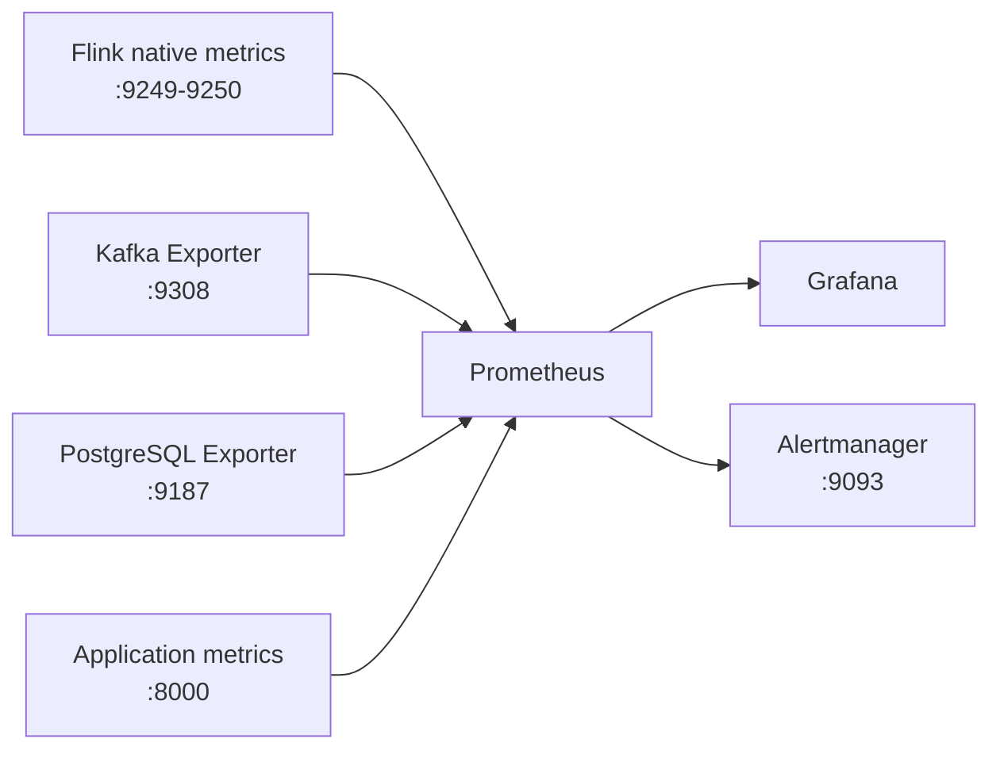

# Pull-Based Monitoring Architecture

This document records the migration from a Pushgateway-only monitoring path to a production-inspired Prometheus pull model.

## What changed

Previously, a Python background thread calculated four metrics and pushed them to Pushgateway. Prometheus scraped only Pushgateway, so metrics named with a `flink_` prefix were derived application values rather than native Flink runtime metrics.

The new design separates metrics by owner:



| Source | Responsibility | Prometheus job |
| --- | --- | --- |
| Flink Prometheus reporter | JobManager, TaskManager, task, operator, JVM, throughput, and restart metrics | `flink` |
| Kafka Exporter | Broker, topic, partition, offset, and consumer-group lag metrics | `kafka` |
| PostgreSQL Exporter | Database availability, sessions, transactions, locks, and storage metrics | `postgresql` |
| Application endpoint | Pipeline outcome and data-quality metrics derived from PostgreSQL and the Kafka DLQ | `application` |

Pushgateway and its Docker service have been removed.

## Implementation details

### Native Flink metrics

`flink-processor/pipeline.py` now:

- points `FLINK_PLUGINS_DIR` to the project-local `plugins/` directory before PyFlink starts;
- checks that `plugins/prometheus/flink-metrics-prometheus-2.2.1.jar` exists;
- enables `org.apache.flink.metrics.prometheus.PrometheusReporterFactory`;
- exposes reporter ports in the `9249-9250` range;
- adds `environment=local` and `pipeline=grab_events` labels;
- enables 30-second checkpoints so Kafka group offsets and checkpoint health are observable.

A range is used because the local PyFlink MiniCluster can start co-located JobManager and TaskManager reporters. Prometheus scrapes both ports, and the availability alert fires only when neither endpoint is reachable.

### Kafka and PostgreSQL exporters

`docker-compose.yml` adds:

- `kafka-exporter` on port `9308`, connected to `kafka:9092`;
- `postgres-exporter` on port `9187`, connected to the `grabevents` database.

The PostgreSQL exporter currently uses the local development database credentials. A deployed environment should use a dedicated, least-privileged monitoring role and a Docker/Kubernetes secret rather than environment variables committed to source control.

### Application business metrics

`monitoring/metrics.py` no longer pushes metrics. It starts an HTTP server on `0.0.0.0:8000`, refreshes source data every 10 seconds, and exposes:

| Metric | Meaning |
| --- | --- |
| `pipeline_events_processed_total` | Current number of valid events persisted in PostgreSQL |
| `pipeline_dlq_events_total` | Current end offset across Kafka DLQ partitions |
| `pipeline_dlq_rate` | DLQ events divided by processed plus DLQ events |
| `pipeline_metrics_collection_success{source=...}` | Whether the latest source collection succeeded |
| `pipeline_metrics_last_collection_timestamp_seconds{source=...}` | Last successful source collection time |

These values intentionally remain separate from native Flink metrics. Kafka consumer lag should now be queried from Kafka Exporter rather than calculated by the application thread.

### Alert routing

Prometheus evaluates `monitoring/prometheus_alerts.yml` and sends firing alerts to Alertmanager. The initial Alertmanager receiver keeps alerts visible in the local UI without sending external notifications. Configure an email, Slack, PagerDuty, or webhook receiver in `monitoring/alertmanager.yml` when a real destination is available.

Configured alerts cover:

- high DLQ rate;
- unavailable Flink metrics endpoints;
- unavailable application metrics;
- failed business-metric source collection;
- unavailable Kafka Exporter;
- unavailable PostgreSQL Exporter.

## Files changed

| File | Change |
| --- | --- |
| `flink-processor/pipeline.py` | Enable and configure the native Flink Prometheus reporter |
| `monitoring/metrics.py` | Replace Pushgateway publishing with a directly scraped HTTP endpoint |
| `monitoring/prometheus.yml` | Add Flink, application, Kafka, PostgreSQL, and self-scrape jobs; route alerts |
| `monitoring/prometheus_alerts.yml` | Update metric names and add component availability alerts |
| `monitoring/alertmanager.yml` | Add local alert grouping and routing configuration |
| `docker-compose.yml` | Remove Pushgateway; add both exporters and Alertmanager |
| `download_jars.sh` | Download the expected connector JARs and Flink reporter plugin |
| `.gitignore` | Ignore downloaded reporter plugins |
| `README.md` | Document the pull architecture, endpoints, and verification workflow |

## Run the monitoring stack

### 1. Download Flink dependencies

Use Git Bash, WSL, macOS, or Linux:

```bash
./download_jars.sh
```

The command downloads connector JARs into `jars/` and the native metric reporter into `plugins/prometheus/`.

### 2. Start the Docker services

```bash
docker compose up -d
docker compose ps
```

### 3. Start the PyFlink pipeline

Activate the Python virtual environment, then run:

```bash
python flink-processor/pipeline.py
```

The local process exposes application metrics on port `8000` and native Flink metrics on one or both ports in the `9249-9250` range.

### 4. Start the producer

```bash
python producer/event_producer.py
```

## Verify the result

Check the raw endpoints from the host:

```bash
curl http://localhost:8000/metrics
curl http://localhost:9249/metrics
curl http://localhost:9250/metrics
curl http://localhost:9308/metrics
curl http://localhost:9187/metrics
```

Depending on how many local Flink components bind reporters, one of the two Flink ports may be unused. At least one must return native metrics while the pipeline is running.

Open the following interfaces:

- Prometheus targets: <http://localhost:9090/targets>
- Prometheus alerts: <http://localhost:9090/alerts>
- Alertmanager: <http://localhost:9093>
- Grafana: <http://localhost:3000>

All expected Prometheus jobs should report at least one healthy target. Useful initial PromQL queries are:

```promql
up
{job="flink"}
pipeline_dlq_rate
kafka_brokers
kafka_consumergroup_lag
pg_up
```

## Local-host networking

Flink and application metrics are served by the host Python process, while Prometheus runs in Docker. Prometheus therefore uses `host.docker.internal`. The Compose configuration adds the `host-gateway` mapping for Linux compatibility; Docker Desktop provides the same hostname on Windows and macOS.

If the Flink and application targets remain down while their local URLs work, check the host firewall and allow Docker to reach ports `8000`, `9249`, and `9250`.

## Remaining production gaps

This is production-inspired rather than production-grade. Flink 2.2 supports Java 11, but Java 17 is its recommended runtime. The next operational improvements should be:

- run Flink as an actual JobManager/TaskManager cluster instead of an embedded local MiniCluster;
- enable and test checkpoints, restart strategies, and state recovery;
- give PostgreSQL Exporter a dedicated least-privileged account;
- configure authenticated and encrypted connections;
- store credentials outside Compose;
- provision Grafana dashboards and an external Alertmanager receiver;
- add persistent Prometheus storage and retention settings;
- test failure, recovery, stale-metric, and alert-delivery scenarios.
