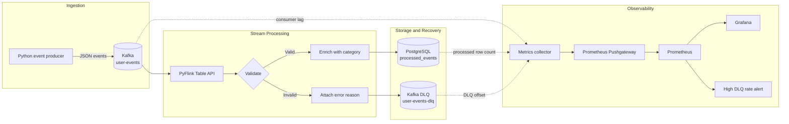

# Grab-Inspired Kafka–Flink Event Processing & Observability Pipeline

A local, end-to-end streaming data project that simulates user activity, processes it with Apache Flink, separates invalid records into a dead-letter queue, and exposes operational metrics through Prometheus and Grafana.

The project is inspired by high-volume super-app event streams such as ride requests, food orders, payments, and grocery orders. It is intended as a hands-on demonstration of event-driven architecture, stream validation, enrichment, fault isolation, persistence, and observability.

## Highlights

- Produces realistic JSON events to Kafka at approximately two events per second.
- Deliberately injects about 20% invalid events to exercise failure handling.
- Validates and enriches events in a single PyFlink streaming job.
- Writes valid records to PostgreSQL and invalid records to a Kafka DLQ.
- Tracks processed records, DLQ volume, DLQ rate, and Kafka consumer lag.
- Provisions Prometheus as the default Grafana data source.
- Includes a Prometheus alert rule for a sustained high DLQ rate.

## Architecture



### Data flow

1. The Python producer generates a mix of valid and intentionally malformed activity events.
2. Kafka stores those events in the `user-events` topic.
3. A PyFlink `StatementSet` reads the source once and routes it into two sinks:
   - valid events are categorized and written to PostgreSQL;
   - invalid events are annotated with an error reason and written to `user-events-dlq`.
4. A background collector polls PostgreSQL and Kafka every 10 seconds and pushes pipeline metrics to Pushgateway.
5. Prometheus scrapes Pushgateway, evaluates alert rules, and serves the metrics to Grafana.

## Technology Stack

| Layer | Technology | Purpose |
| --- | --- | --- |
| Event generation | Python, Faker | Generate representative user activity |
| Message broker | Confluent Kafka image 7.4.0 | Durable event ingestion and DLQ storage |
| Stream processing | Apache Flink / PyFlink 2.2.1 | Validate, enrich, and route events |
| Operational storage | PostgreSQL 15 | Persist successfully processed events |
| Metric handoff | Prometheus Pushgateway 1.6.2 | Receive metrics from the local Flink process |
| Monitoring | Prometheus 2.47.0 | Scrape metrics and evaluate alerts |
| Visualization | Grafana 10.1.0 | Explore and visualize pipeline health |
| Local infrastructure | Docker Compose | Run supporting services |

## Event Contract

Events are serialized as JSON:

```json
{
  "user_id": "user_4821",
  "event_type": "ride_request",
  "timestamp": 1787486400000,
  "amount": 24.5
}
```

Supported event types and their enriched categories are:

| Event type | Category |
| --- | --- |
| `food_order` | `FOOD` |
| `ride_request` | `TRANSPORT` |
| `payment` | `FINANCE` |
| `grocery_order` | `GROCERY` |

An event is valid when `user_id` is present, `event_type` is supported, and `amount` is non-negative. Invalid records are routed to the DLQ with one of `NULL_USER_ID`, `INVALID_EVENT_TYPE`, `NEGATIVE_AMOUNT`, or `MULTIPLE_ERRORS`.

## Getting Started

### Prerequisites

- Docker Desktop with Docker Compose
- Python 3.11
- A Java runtime compatible with the installed PyFlink release
- Bash and `curl` for downloading connector JARs

All commands below are run from the `grab-se-backend` directory.

### 1. Create a Python environment

PowerShell:

```powershell
python -m venv .venv
.\.venv\Scripts\Activate.ps1
python -m pip install --upgrade pip
pip install -r requirements.txt
```

macOS, Linux, or Git Bash:

```bash
python -m venv .venv
source .venv/bin/activate
python -m pip install --upgrade pip
pip install -r requirements.txt
```

### 2. Download the Flink connectors

`pipeline.py` expects the following files under `jars/`:

```text
flink-sql-connector-kafka-4.0.1-2.0.jar
flink-connector-jdbc-core-4.0.0-2.0.jar
flink-connector-jdbc-postgres-4.0.0-2.0.jar
postgresql-42.6.0.jar
```

Download the matching artifacts from Maven Central:

```bash
mkdir -p jars
curl -L -o jars/flink-sql-connector-kafka-4.0.1-2.0.jar https://repo.maven.apache.org/maven2/org/apache/flink/flink-sql-connector-kafka/4.0.1-2.0/flink-sql-connector-kafka-4.0.1-2.0.jar
curl -L -o jars/flink-connector-jdbc-core-4.0.0-2.0.jar https://repo.maven.apache.org/maven2/org/apache/flink/flink-connector-jdbc-core/4.0.0-2.0/flink-connector-jdbc-core-4.0.0-2.0.jar
curl -L -o jars/flink-connector-jdbc-postgres-4.0.0-2.0.jar https://repo.maven.apache.org/maven2/org/apache/flink/flink-connector-jdbc-postgres/4.0.0-2.0/flink-connector-jdbc-postgres-4.0.0-2.0.jar
curl -L -o jars/postgresql-42.6.0.jar https://repo.maven.apache.org/maven2/org/postgresql/postgresql/42.6.0/postgresql-42.6.0.jar
```

> [!IMPORTANT]
> The current `download_jars.sh` helper targets an older connector set and does not produce all four filenames expected by `pipeline.py`. Synchronize the helper with the list above before using it, or place the four matching artifacts in `jars/` manually.

### 3. Start the infrastructure

```bash
docker compose up -d
docker compose ps
```

Kafka can take a few seconds to become ready. Confirm the broker is responding:

```bash
docker exec kafka kafka-topics --bootstrap-server localhost:9092 --list
```

### 4. Start the Flink pipeline

Open a new terminal, activate the virtual environment, and run:

```bash
python flink-processor/pipeline.py
```

The job reads from the earliest available offset, so events published before startup will still be processed.

### 5. Start producing events

Open another terminal, activate the virtual environment, and run:

```bash
python producer/event_producer.py
```

The producer continues until you press `Ctrl+C`.

## Explore the Pipeline

### Service endpoints

| Service | URL / connection | Credentials |
| --- | --- | --- |
| Grafana | <http://localhost:3000> | `admin` / `admin` |
| Prometheus | <http://localhost:9090> | None |
| Pushgateway | <http://localhost:9091> | None |
| Kafka from host | `localhost:29092` | None |
| PostgreSQL | `localhost:5432/grabevents` | `grabuser` / `grabpass` |

Grafana automatically receives Prometheus as its default data source. The provisioning directory currently contains no dashboard JSON, so create a dashboard and add panels using the metrics below.

### Available metrics

| Metric | Meaning |
| --- | --- |
| `flink_events_processed_total` | Current count of valid rows in PostgreSQL |
| `flink_dlq_events_total` | Total end offset across DLQ partitions |
| `flink_dlq_rate` | DLQ events divided by all observed events |
| `flink_consumer_lag_messages` | Source end offset minus the Flink group offset |

Suggested Grafana panels include processed events, DLQ events, DLQ percentage, and consumer lag. Prometheus also loads the `HighDLQRate` warning rule from `monitoring/prometheus_alerts.yml`.

### Inspect processed records

```bash
docker exec postgres psql -U grabuser -d grabevents -c \
  "SELECT * FROM processed_events ORDER BY processed_at DESC LIMIT 10;"
```

### Inspect the dead-letter queue

```bash
docker exec kafka kafka-console-consumer \
  --bootstrap-server localhost:9092 \
  --topic user-events-dlq \
  --from-beginning \
  --max-messages 5
```

Example DLQ record:

```json
{
  "user_id": null,
  "event_type": "payment",
  "timestamp": 1787486400000,
  "amount": 10.25,
  "error_reason": "NULL_USER_ID"
}
```

## Project Structure

```text
grab-se-backend/
├── docker-compose.yml                 # Local infrastructure
├── requirements.txt                   # Python dependencies
├── download_jars.sh                   # Connector download helper
├── producer/
│   └── event_producer.py              # Synthetic Kafka producer
├── flink-processor/
│   └── pipeline.py                    # PyFlink routing pipeline
├── monitoring/
│   ├── metrics.py                     # Metrics collector and pusher
│   ├── prometheus.yml                 # Scrape configuration
│   ├── prometheus_alerts.yml          # Alert rules
│   └── grafana/provisioning/          # Data source and dashboard provisioning
└── sql/
    └── init.sql                       # PostgreSQL schema and indexes
```

## Stopping and Resetting

Stop the producer and Flink process with `Ctrl+C`, then stop the containers while preserving PostgreSQL and Grafana volumes:

```bash
docker compose down
```

To perform a clean reset and delete local container data:

```bash
docker compose down -v
```

## Development Notes

This project is configured for local learning and demonstration. Kafka uses plaintext communication and a single broker, credentials are committed development defaults, Flink runs at parallelism `1`, and Kafka retains logs for one hour. Production deployments should use secrets management, authenticated and encrypted connections, replicated brokers, checkpointing, schema management, durable metric collection, and environment-based configuration.

## Ideas for Extension

- Add a provisioned Grafana dashboard and Alertmanager notification route.
- Introduce Avro or Protobuf with a schema registry.
- Add Flink checkpoints and restart strategies.
- Containerize the producer and PyFlink job.
- Add event-time windows for revenue and activity aggregates.
- Replace hard-coded settings with environment variables.
- Add automated tests for validation and routing behavior.
