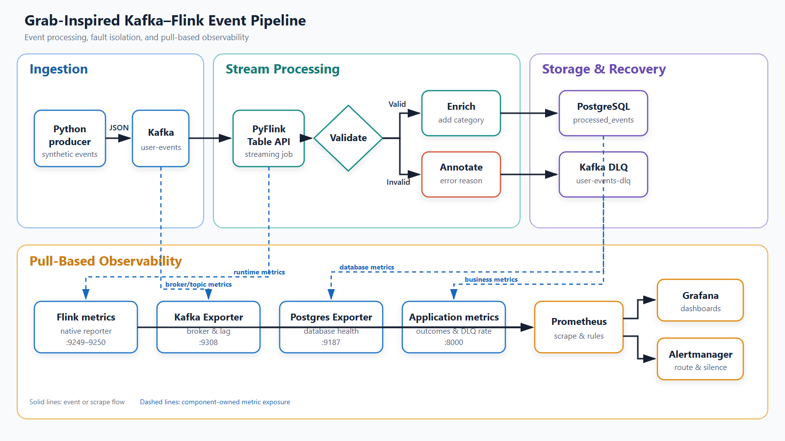

# Grab-Inspired Kafka–Flink Event Processing & Observability Pipeline

A local, end-to-end streaming data project that simulates user activity, processes it with Apache Flink, separates invalid records into a dead-letter queue, and exposes operational metrics through Prometheus and Grafana.

The project is inspired by high-volume super-app event streams such as ride requests, food orders, payments, and grocery orders. It is intended as a hands-on demonstration of event-driven architecture, stream validation, enrichment, fault isolation, persistence, and observability.

## Highlights

- Produces realistic JSON events to Kafka at approximately two events per second.
- Produces valid traffic by default, with an opt-in fault profile injecting about 20% invalid events.
- Validates and enriches events in a single PyFlink streaming job.
- Writes valid records to PostgreSQL and invalid records to a Kafka DLQ.
- Exposes native Flink runtime metrics and separate application data-quality metrics.
- Monitors Kafka and PostgreSQL through dedicated Prometheus exporters.
- Provisions Prometheus and a sixteen-panel operational Grafana dashboard.
- Routes pipeline and component-health alerts to Alertmanager.
- Optionally archives raw and validated events to Iceberg on MinIO, with Trino analytics and snapshot-pinned replay.
- Optionally runs separate containerized JobManager, TaskManager, producer and metrics collector.
- Versions the JSON event contract and provides CI plus an automated TaskManager crash/replay drill.

## Architecture



The detailed monitoring design and migration notes are in [MONITORING_ARCHITECTURE.md](MONITORING_ARCHITECTURE.md).

The recommendation audit, container startup, versioned contract and automated
recovery evidence are in [REMAINING_UPGRADES.md](REMAINING_UPGRADES.md). This guide
distinguishes implemented improvements from business features still missing.

The correctness enhancement, existing-database migration, delivery guarantees,
tests and recovery procedure are documented in [CORRECTNESS_AND_RECOVERY.md](CORRECTNESS_AND_RECOVERY.md).
Apply the migration in that guide before starting the upgraded job against an existing database.

Event-time payment revenue and activity windows, migration 002, producer delay/duplicate
simulation and late-data reconciliation are documented in [EVENT_TIME_BUSINESS_LOGIC.md](EVENT_TIME_BUSINESS_LOGIC.md).

The next enhancement adds recent data-quality and latency metrics, operational
alerts, runbooks and a finite reconciliation benchmark. Setup and migration 003
are in [OPERATIONAL_DASHBOARDS_AND_BENCHMARKS.md](OPERATIONAL_DASHBOARDS_AND_BENCHMARKS.md).

The optional streaming lakehouse, source-built MinIO images, Java 17 setup,
late-inclusive atomic revenue repair and snapshot-pinned replay are documented
in [ICEBERG_AND_REPLAY.md](ICEBERG_AND_REPLAY.md). The default job does not require
these extra services; enable them with `LAKEHOUSE_ENABLED=1`.

### Data flow

1. The Python producer generates a mix of valid and intentionally malformed activity events.
2. Kafka stores those events in the `user-events` topic.
3. A PyFlink `StatementSet` reads the source and writes four outputs:
   - valid events are categorized and written to PostgreSQL;
   - invalid events are annotated with an error reason and written to `user-events-dlq`;
   - deduplicated payment revenue and activity counts are written to event-time window tables.
4. Flink exposes native runtime metrics while a separate application endpoint exposes data-quality metrics.
5. Kafka Exporter and PostgreSQL Exporter expose infrastructure metrics.
6. Prometheus scrapes every endpoint, supplies Grafana, and routes alerts to Alertmanager.

The DataLens evidence foundation adds a metric catalogue, persisted quality observations,
payment-specific freshness and read-only revenue comparisons. Setup and limitations are
in [DATALENS_EVIDENCE.md](DATALENS_EVIDENCE.md).

## Technology Stack

| Layer | Technology | Purpose |
| --- | --- | --- |
| Event generation | Python, Faker | Generate representative user activity |
| Message broker | Confluent Kafka image 7.4.0 | Durable event ingestion and DLQ storage |
| Stream processing | Apache Flink / PyFlink 2.2.1 | Validate, enrich, and route events |
| Operational storage | PostgreSQL 15 | Persist successfully processed events |
| Metric exporters | Flink reporter, Kafka Exporter, PostgreSQL Exporter | Expose component-owned metrics |
| Monitoring | Prometheus 2.47.0 | Scrape metrics and evaluate alerts |
| Visualization | Grafana 10.1.0 | Explore and visualize pipeline health |
| Alert routing | Alertmanager 0.32.1 | Group, silence, and route alerts |
| Local infrastructure | Docker Compose | Run supporting services |
| Optional lakehouse | Iceberg 1.12.0, MinIO, Trino 483 | Raw history, validated deliveries, SQL reconciliation and replay |

## Event Contract

Events are serialized as JSON:

```json
{
  "schema_version": 1,
  "event_id": "f08cbb06-eaa5-4c69-9ae1-2d2d12d102fd",
  "user_id": "user_4821",
  "event_type": "ride_request",
  "timestamp": 1787486400000,
  "amount": 24.5,
  "currency": "MYR"
}
```

Supported event types and their enriched categories are:

| Event type | Category |
| --- | --- |
| `food_order` | `FOOD` |
| `ride_request` | `TRANSPORT` |
| `payment` | `FINANCE` |
| `grocery_order` | `GROCERY` |

Events require a stable event ID, non-blank user ID, supported event type, valid epoch timestamp, three-letter uppercase currency and non-negative decimal amount with no fractional cents. The validator preserves malformed payloads and reports all failing rules in the DLQ. See the correctness guide for the full contract; older events without event ID or currency are now invalid.

## Getting Started

### Prerequisites

- Docker Desktop with Docker Compose
- Python 3.11
- Java 17 recommended for Flink 2.2 (Java 11 is also supported)
- Bash and `curl` for downloading connector JARs

All commands below are run from the `grab-se-backend` directory.

### 1. Create a Python environment

PowerShell:

```powershell
python -m venv .venv
.\.venv\Scripts\Activate.ps1
python -m pip install --upgrade pip
pip install -r requirements.txt
```

macOS, Linux, or Git Bash:

```bash
python -m venv .venv
source .venv/bin/activate
python -m pip install --upgrade pip
pip install -r requirements.txt
```

### 2. Download the Flink connectors and metrics reporter

Run the helper from Git Bash, WSL, macOS, or Linux:

```bash
./download_jars.sh
```

`pipeline.py` expects the following connector files under `jars/`:

```text
flink-sql-connector-kafka-4.0.1-2.0.jar
flink-connector-jdbc-core-4.0.0-2.0.jar
flink-connector-jdbc-postgres-4.0.0-2.0.jar
postgresql-42.6.0.jar
```

It also installs `flink-metrics-prometheus-2.2.1.jar` under `plugins/prometheus/`. The pipeline fails early with a clear error when the reporter is missing.

### 3. Start the infrastructure

```bash
docker compose up -d
docker compose ps
```

Kafka can take a few seconds to become ready. Confirm the broker is responding:

```bash
docker exec kafka kafka-topics --bootstrap-server localhost:9092 --list
```

### 4. Start the Flink pipeline

Open a new terminal, activate the virtual environment, and run:

```bash
python flink-processor/pipeline.py
```

The job reads from the earliest available offset, so events published before startup will still be processed.

### 5. Start producing events

Open another terminal, activate the virtual environment, and run:

```bash
python producer/event_producer.py
```

The producer continues until you press `Ctrl+C`.

## Explore the Pipeline

### Service endpoints

| Service | URL / connection | Credentials |
| --- | --- | --- |
| Grafana | <http://localhost:3000> | `admin` / `admin` |
| Prometheus | <http://localhost:9090> | None |
| Alertmanager | <http://localhost:9093> | None |
| Application metrics | <http://localhost:8000/metrics> | None |
| Flink metrics | `http://localhost:9249/metrics`, `:9250/metrics` | None |
| Kafka Exporter | <http://localhost:9308/metrics> | None |
| PostgreSQL Exporter | <http://localhost:9187/metrics> | None |
| Kafka from host | `localhost:29092` | None |
| PostgreSQL | `localhost:5432/grabevents` | `grabuser` / `grabpass` |
| Optional MinIO S3 / console | `localhost:19000` / <http://localhost:19001> | `lakehouse` / `lakehouse-local-password` |
| Optional Iceberg REST / Trino | `localhost:18181` / <http://localhost:18080> | Local development services |

Grafana automatically receives Prometheus and the **Payments pipeline operations**
dashboard in the **Flink Pipeline** folder. Open
<http://localhost:3000/d/grab-pipeline-operations>.

### Available metrics

| Metric | Meaning |
| --- | --- |
| `pipeline_events_processed_total` | Current count of valid rows in PostgreSQL |
| `pipeline_dlq_events_total` | Total end offset across DLQ partitions |
| `pipeline_dlq_rate` | Legacy cumulative fraction of differing populations; not used for alerts |
| `pipeline_invalid_fraction_window` | Five-minute source invalid fraction from an independent observer |
| `pipeline_invalid_events_window{reason}` | Recent invalid source records by bounded primary reason |
| `pipeline_audit_latency_seconds{clock,quantile}` | Recent event/broker-to-processing latency percentiles |
| `pipeline_audit_freshness_seconds` | Age of latest audit processing timestamp |
| `pipeline_metrics_collection_success` | Health of each business-metric source collection |

Native Flink, Kafka, and PostgreSQL metric names are supplied by their respective reporters. Check <http://localhost:9090/targets> to verify every scrape job, then use `{job="flink"}`, `{job="kafka"}`, and `{job="postgresql"}` to explore them. Suggested Grafana panels include Flink throughput and restarts, Kafka consumer lag, PostgreSQL sessions, processed events, and DLQ percentage.

### Inspect processed records

```bash
docker exec postgres psql -U grabuser -d grabevents -c \
  "SELECT * FROM processed_events ORDER BY processed_at DESC LIMIT 10;"
```

### Inspect the dead-letter queue

```bash
docker exec kafka kafka-console-consumer \
  --bootstrap-server localhost:9092 \
  --topic user-events-dlq \
  --from-beginning \
  --max-messages 5
```

Example DLQ record:

```json
{
  "record_id": "user-events:0:42",
  "source_topic": "user-events",
  "source_partition": 0,
  "source_offset": 42,
  "ingested_at": "2026-10-03 12:00:00",
  "raw_payload_base64": "e2Jyb2tlbg==",
  "error_reason": "MALFORMED_JSON",
  "validation_errors": "[\"MALFORMED_JSON\"]"
}
```

## Project Structure

```text
grab-se-backend/
├── docker-compose.yml                 # Local infrastructure
├── MONITORING_ARCHITECTURE.md         # Monitoring implementation guide
├── requirements.txt                   # Python dependencies
├── download_jars.sh                   # Connector download helper
├── producer/
│   └── event_producer.py              # Synthetic Kafka producer
├── flink-processor/
│   └── pipeline.py                    # PyFlink routing pipeline
├── monitoring/
│   ├── metrics.py                     # Direct application metrics endpoint
│   ├── alertmanager.yml               # Local alert routing
│   ├── prometheus.yml                 # Scrape configuration
│   ├── prometheus_alerts.yml          # Alert rules
│   └── grafana/provisioning/          # Data source and dashboard provisioning
└── sql/
    └── init.sql                       # PostgreSQL schema and indexes
```

## Stopping and Resetting

Stop the producer and Flink process with `Ctrl+C`, then stop the containers while preserving PostgreSQL and Grafana volumes:

```bash
docker compose down
```

To perform a clean reset and delete local container data:

```bash
docker compose down -v
```

## Development Notes

This project is configured for local learning and demonstration. Kafka uses plaintext communication and a single broker, credentials are committed development defaults, and Flink runs at parallelism `1`. Kafka data is persisted in a volume with a seven-day default retention. Flink retains disk checkpoints and supports explicit process recovery; PostgreSQL writes are idempotent by event ID and DLQ delivery is at-least-once. Production deployments still need secrets management, authenticated and encrypted connections, replicated brokers, shared checkpoint storage, schema management and durable metric collection.

## Ideas for Extension

- Add an external Alertmanager receiver and persistent Prometheus storage.
- Introduce Avro or Protobuf with a schema registry.
- Expand automated failure/recovery drills and add JobManager high availability.
- Extend the existing event-time windows with merchant enrichment and payment/order lifecycle metrics.
- Extend environment-based configuration to the remaining services.
- Benchmark analytics queries before adding a dedicated OLAP engine or a read-only AI operations assistant.
